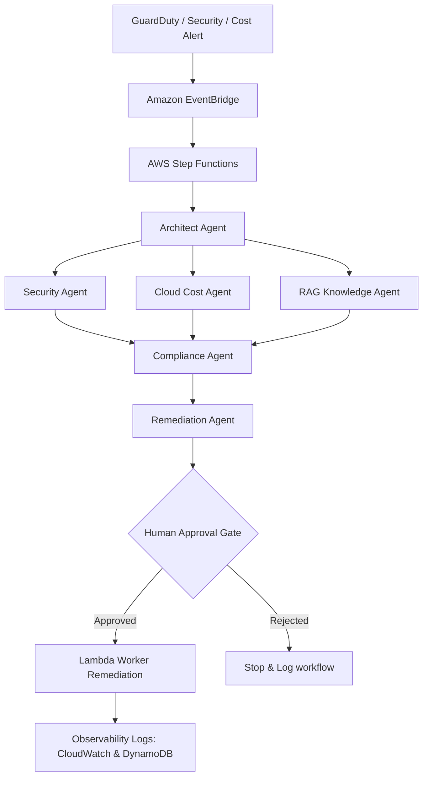

# Enterprise Agentic Operations Command Center

An AWS-native, security-first Operations Command Center showcasing multi-agent incident detection, RAG policy reasoning, cost metrics logs, and human-in-the-loop validation rules.

---

## 🎯 Project Overview
This project simulates enterprise-grade operations. It detects inbound security findings or cloud cost anomalies via EventBridge, coordinates specialized agents inside AWS Step Functions to investigate findings using policy document databases, and holds execution at a Human Gate before launching any automated AWS remediation API calls.

## 🛠️ Technology Stack
* **Cloud Infrastructure**: AWS CDK (S3, DynamoDB, Lambda, EventBridge, IAM, Step Functions schemas)
* **Agentic Backend**: FastAPI, Uvicorn, Python
* **Interactive Frontend**: React, Vite, TypeScript, Tailwind CSS v4, Lucide Icons, Framer Motion

---

## 🧬 Orchestration System Flow



---

## 🚀 Setup & Execution

### 1. Run Backend Server (FastAPI)
```bash
pip install -r requirements.txt
python src/api/main.py
```
Backend will listen at: **`http://localhost:8000`**

### 2. Run Dashboard (React)
```bash
cd frontend
npm install
npm run dev
```
Dashboard will open at: **`http://localhost:5173`**
*(Application defaults to local Sandbox Mode if the Python backend is not running).*

---

## 📂 Project Architecture Layout
* **`docs/`**: Architecture diagrams, security rules, and interview demo scripts.
* **`infra/cdk/`**: CDK stacks declaring DynamoDB schemas, runbook S3 buckets, EventBridge rules, and least privilege roles.
* **`src/agents/`**: Core logic for the nine specialized agents (Architect, Security, Cost, etc.).
* **`src/guardrails/`**: Access controls whitelists and session token budget containment.
* **`src/orchestration/`**: Step Functions state machine JSON configuration and routing rules.
* **`frontend/`**: The Command Center React interface.
