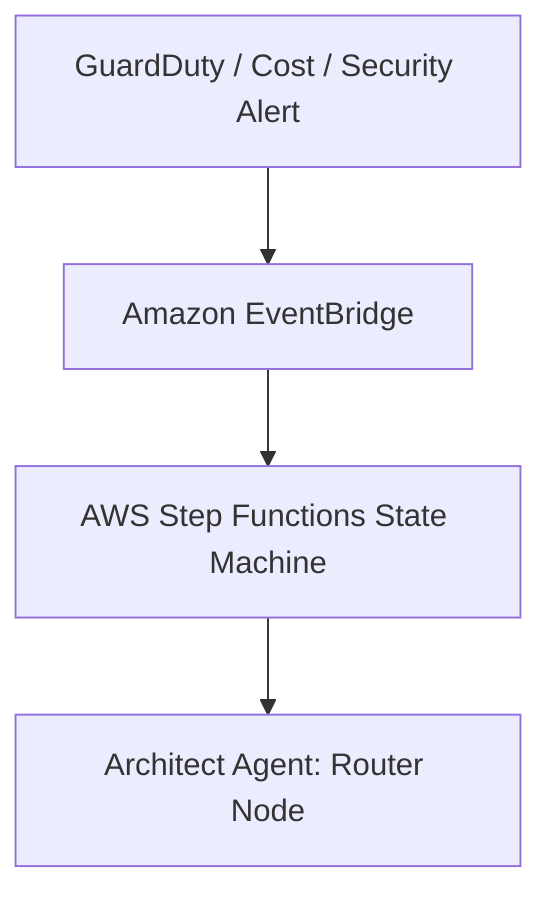
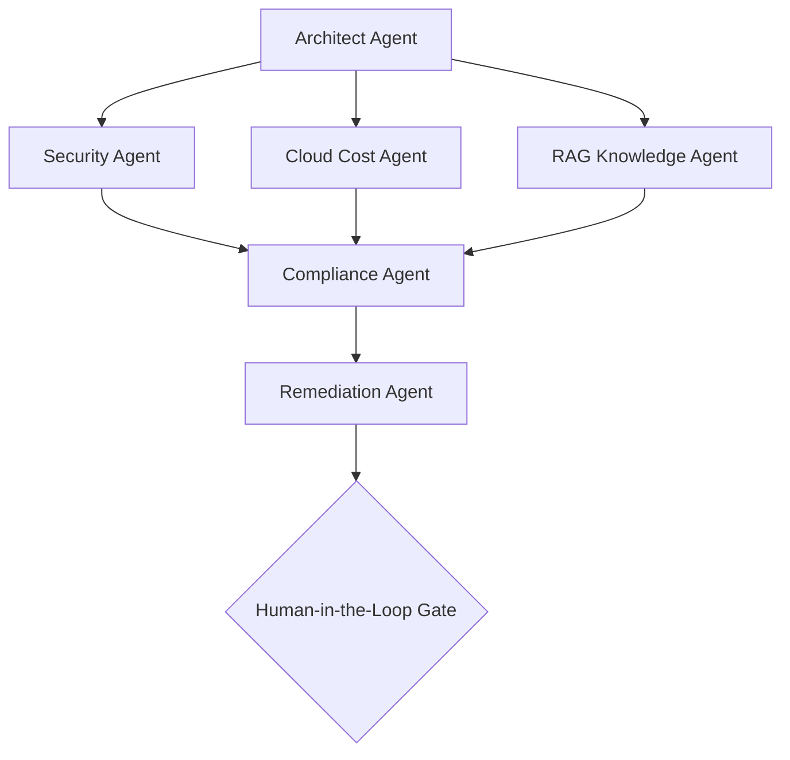

# System Architecture

This document describes the cloud architecture and event routing model for the **Enterprise Agentic Operations Command Center** (`aws-agentic-ops-command-center`).

---

## 🧬 Event Ingestion & Trigger Pipeline

### 1. Alert Sources
* **Amazon GuardDuty**: Detects compromised instances, IAM credential exposure, and anomalous VPC traffic.
* **AWS Security Hub**: Aggregates vulnerability logs and IAM compliance warnings.
* **AWS Cost Explorer**: Flags daily spending anomalies exceeding predefined standard baseline limits.

### 2. Event Routing
Amazon EventBridge triggers a target AWS Step Functions orchestration state machine on incoming JSON alerts, passing the payload configuration downstream.

---

## 🤖 Specialized Multi-Agent Team

Once initialized, the **Architect Agent** delegates tasks to specialized reasoning nodes:

1. **Security Agent**: Parses GuardDuty finding severity scores, identifies target AWS resource IDs, and defines safety scopes.
2. **Cloud Cost Agent**: Calculates immediate waste and billing impact metrics.
3. **RAG Knowledge Agent**: Queries S3-based corporate security directives and runbook databases to extract source-grounded evidence citations.
4. **Compliance Agent**: Compares proposed CLI actions against AWS Foundations benchmark rule compliance.
5. **Remediation Agent**: Generates the target AWS CLI command payload for approval.
6. **Human Approval Agent**: Suspends step functions execution, logging a manual override token in DynamoDB, and alerts the operator interface.
7. **Observability Agent**: Formats execution logs, total tokens consumed, and latencies, posting trace records back to CloudWatch and DynamoDB.
